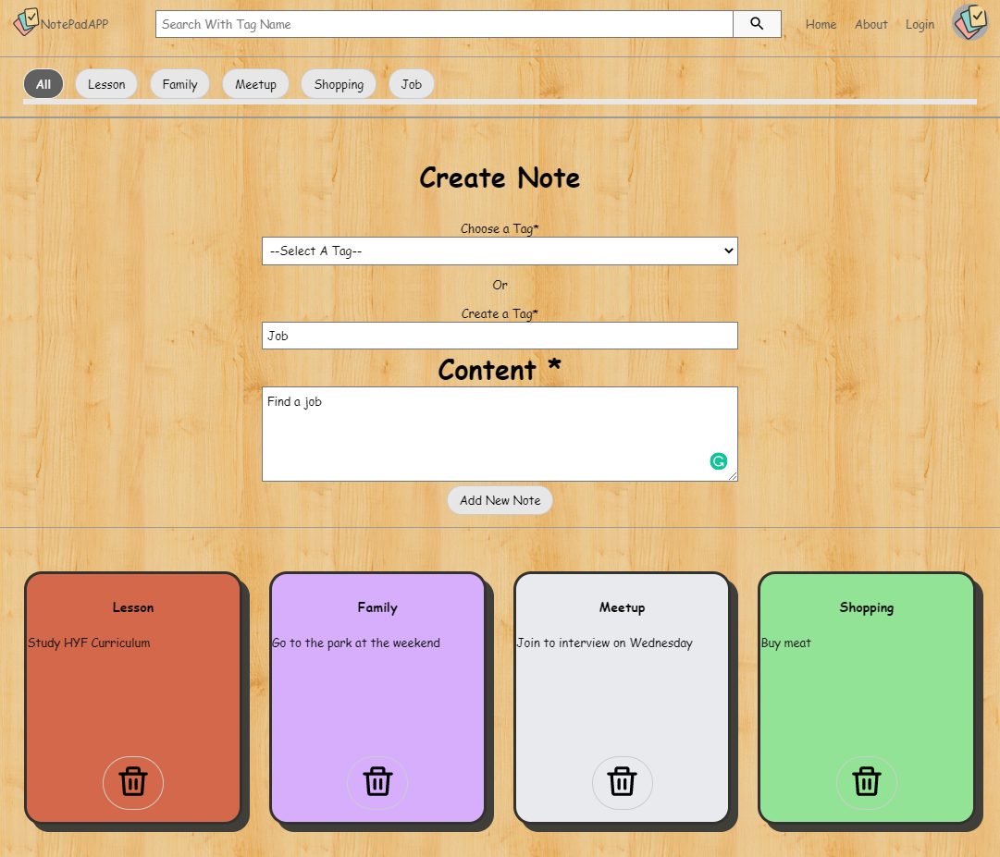

# NotePadApp

## Page design:

## Check the project webpage:

You can test the app from [here](https://fikretyilmaz.github.io/NotePadApp/):
**This is a NotepadApp which allows you to take note.
I used the basic [Youtube][https://www.youtube.com/] webpage style and change that with mine. I studied with [themoviedb][https://api.themoviedb.org/3] API to get tag name.**

### Must have features:

- [x] I will choose something in figma and adept to my app.
- [x] From beginning I only want to use TvMaze API to create my note Title,
- [x] user can create his/her own tag
- [x] User can see each note after he/she added.
- [x] User can delete and update the note.
- [x] Add a search button

### nice to have features:

- [x] Add category buttons to categorize the tag
- [x] User can open an account via social madia account(twitter,facebook,google,github),
- [x] User can share note on twitter and facebook,
- [x] Using server to save data and make JSON file to create an API.
